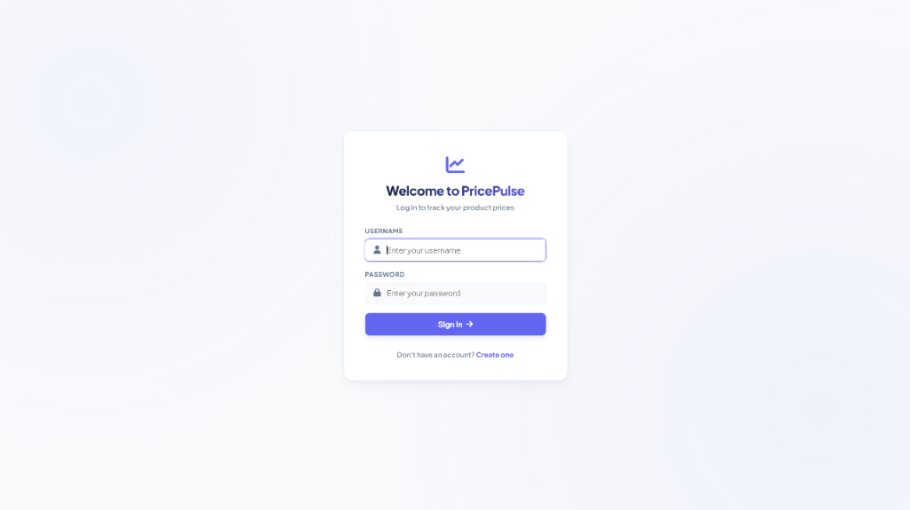
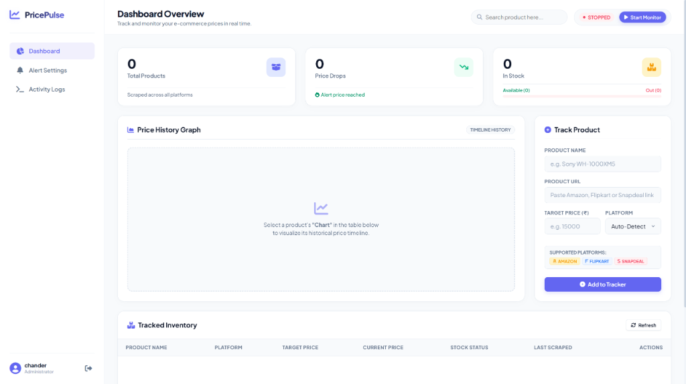
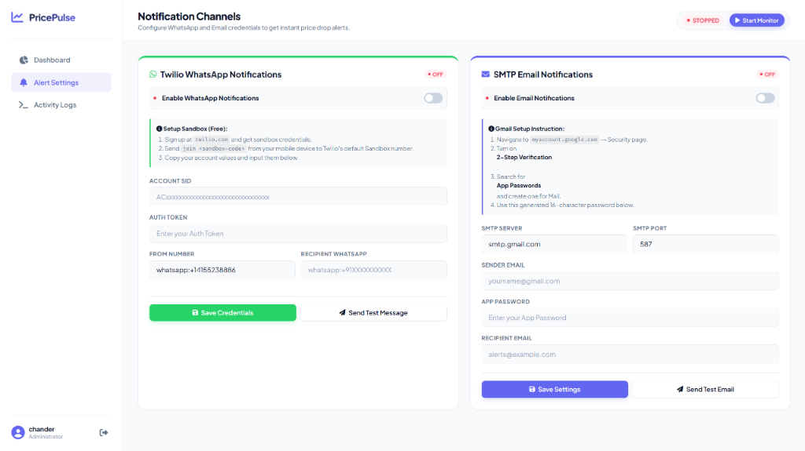
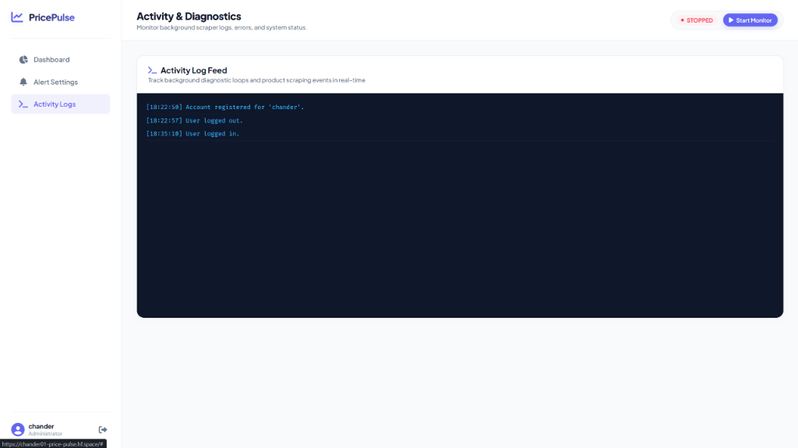

# 🛒 PricePulse — Premium Multi-Platform Price Tracker

<p align="center">
  <a href="https://huggingface.co/spaces/chander01/Price-pulse" target="_blank">
    
  </a>
  
  
  
  
  
</p>

<p align="center">
  Track product prices across <strong>Amazon</strong>, <strong>Flipkart</strong>, and <strong>Snapdeal</strong> — all from a single sleek, professional dashboard. Get instant <strong>WhatsApp & Email alerts</strong> when prices drop to your target! 🔥
</p>

---

## 📸 App Preview

<table width="100%">
  <tr>
    <td width="50%" align="center">
      <strong>🔐 Elegant Login Interface</strong><br/>
      
    </td>
    <td width="50%" align="center">
      <strong>📊 Interactive Admin Dashboard</strong><br/>
      
    </td>
  </tr>
  <tr>
    <td width="50%" align="center">
      <strong>💬 Multi-Channel Alert Settings</strong><br/>
      
    </td>
    <td width="50%" align="center">
      <strong>📈 Real-time Scraper Activity Logs</strong><br/>
      
    </td>
  </tr>
</table>

---

## ✨ Features

| Feature | Description |
|---|---|
| 🛍️ **Multi-Platform** | Scrapes Amazon India, Flipkart & Snapdeal simultaneously |
| 🤖 **Auto-Detection** | Paste any product URL — platform is detected automatically |
| 📈 **Price History** | Interactive Chart.js bezier-curve graphs showing price trends over time |
| 📦 **Stock Alerts** | Dynamic available-to-out ratio bar meter and stock recovery alerts |
| 💬 **WhatsApp Alerts** | Real-time WhatsApp notifications via Twilio REST API on price drops |
| ✉️ **Email Alerts** | Custom SMTP email notifications (works with Gmail App Passwords) |
| 🎨 **Premium UI** | Modern light-mode tech dashboard with left sidebar navigation tabs |
| 🔄 **Auto Monitor** | Background thread scrapes all products at regular intervals |
| 💾 **Persistent DB** | All data stored locally/persistently in SQLite — no complex cloud setup |
| 🐳 **Docker Ready** | Fully dockerized and optimized for Hugging Face Spaces deployment |

---

## 🚀 Quick Start (Local Run)

### 1. Clone the repository

```bash
git clone https://github.com/Chandersingh0/Ecommerce-product-tracker.git
cd pricepulse
```

### 2. Create a virtual environment

```bash
# Windows
python -m venv venv
venv\Scripts\activate

# macOS / Linux
python3 -m venv venv
source venv/bin/activate
```

### 3. Install dependencies

```bash
pip install -r requirements.txt
playwright install chromium
playwright install-deps
```

### 4. Run the app

```bash
python app.py
```

### 5. Open your browser

Navigate to `http://localhost:5000` (Default credentials: **admin / admin**).

---

## 📲 Notification Setup (Optional)

Configure your alert channels directly inside the **"Alert Settings"** tab in the sidebar:

### A. WhatsApp Setup (via Twilio Sandbox)
1. Register a free account at [twilio.com](https://www.twilio.com).
2. Go to **Messaging → Try WhatsApp** and opt-in by sending `join <sandbox-code>` from your WhatsApp.
3. Paste your **Account SID**, **Auth Token**, **From number** (sandbox), and **Recipient number** in the Settings panel.

### B. Email Setup (via SMTP / Gmail)
1. Go to your Google Account Settings &rarr; Security.
2. Enable **2-Step Verification**.
3. Generate a 16-character **App Password** for "Mail".
4. Configure the SMTP server (`smtp.gmail.com`), port (`587`), sender email, and App Password in the Settings panel.

---

## 🐳 Hugging Face Spaces Deployment

The live application is deployed and available on Hugging Face Spaces:
👉 **[Live Demo on Hugging Face Spaces](https://chander01-price-pulse.hf.space/login)**


## 🗂️ Project Structure

```
pricepulse/
│
├── app.py                  # Flask webapp + scrapers + background monitor threads
├── Dockerfile              # Playwright, Chromium & Hugging Face optimized build file
├── requirements.txt        # python packages
├── products.db             # Local SQLite database (auto-generated)
│
└── templates/
    ├── index.html          # Core responsive light-theme dashboard UI
    ├── login.html          # Polished sign-in interface
    └── register.html       # Polished account registration interface
```

---

## 🛠️ Tech Stack

- **Backend:** Python 3, Flask
- **Scraping:** Requests, BeautifulSoup4, Playwright Chromium (for anti-bot rendering)
- **Database:** SQLite (via standard library `sqlite3`)
- **Frontend:** HTML5, CSS3 Grid/Flexbox, Vanilla JS, Chart.js, Font Awesome
- **Notifications:** Twilio REST API, SMTP SSL/TLS

---

## 📝 License

This project is licensed under the **MIT License**.
